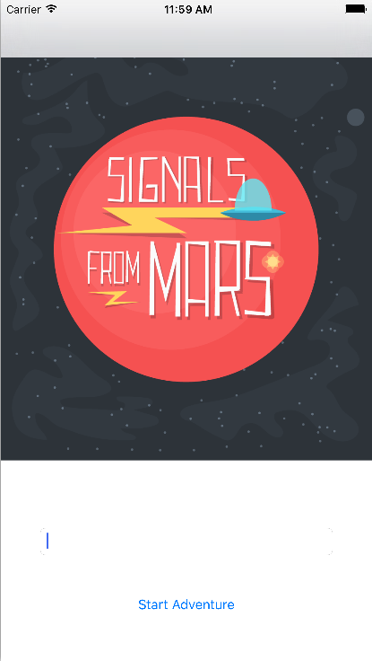
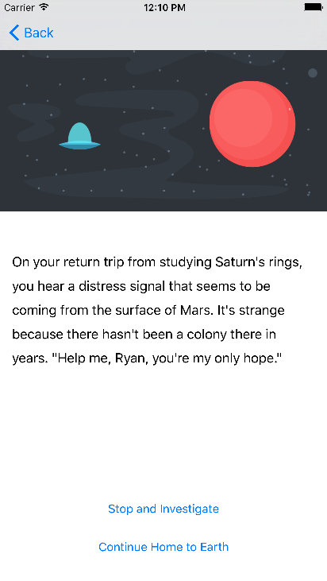

## **LostInSpace** is a interactive story app written for iOS in Swift.

Intro #1            |  Sample Story Page #2
:-------------------------:|:-------------------------:
  |  

***

## Objectives

#### This is my second iOS app and was inspired by a Treehouse tutorial. It's a complex, user-driven story that is similar to the old "Choose Your Own Adventure" novels. The app required a more in-depth dive into Swift, hitting such topics as navigation controllers, hierarchical data models, and custom views. User input (the main character's name dynamically changes in the story depending the nomenclature choice of the user) and sound effects were also a couple more of the complex wirings I explored. In addition, it helps reinforce my grasp of the basics: data types, control flow, conditionals, sound MVC practices, version control, and the various intricacies of using Apple's **IDE Xcode**.

##### Copyright (c) 2016 - Ryan Oakes
